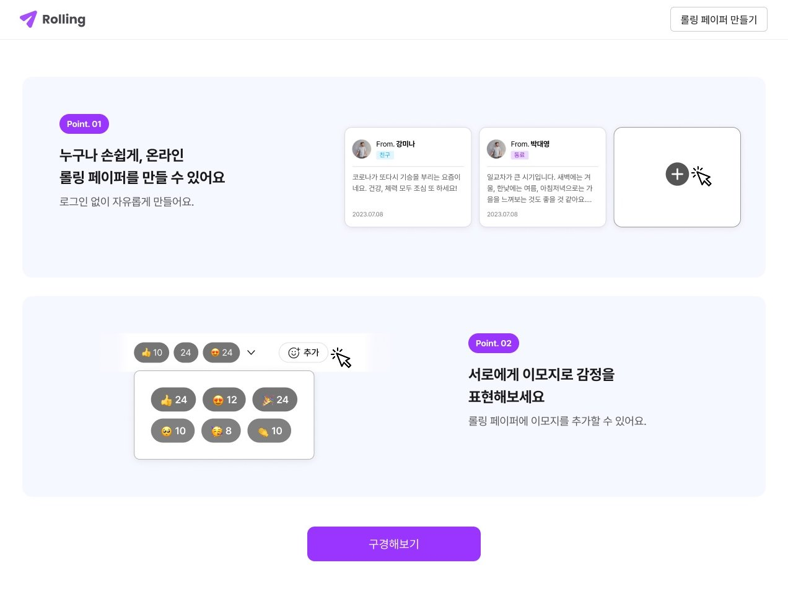
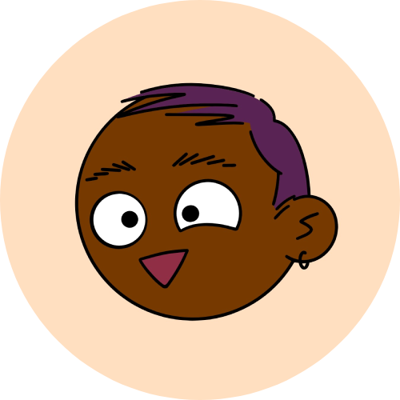

#  Rolling



롤링페이퍼를 생성하고 메시지를 남길 수 있는 웹 서비스  
특정 사람을 위한 롤링페이퍼를 만들고, 메시지와 이모지를 남기며 축하와 응원의 마음을 전달할 수 있다.

🔗 배포 링크  
https://rolling-fe23-5.netlify.app/

---

## ✨ 주요 기능

📄 **롤링페이퍼 생성** : 특정 사람을 위한 롤링페이퍼를 생성할 수 있다.

💌 **메시지 작성** : 롤링페이퍼에 축하와 응원의 메시지를 남길 수 있다.

😀 **이모지 반응 추가** : 메시지에 이모지를 추가하여 감정을 표현할 수 있다.

💬 **롤링페이퍼 공유** : 카카오톡 또는 URL을 통해 롤링페이퍼를 공유할 수 있다.

🗑 **롤링페이퍼 및 메시지 삭제** : 생성된 롤링페이퍼와 메시지를 삭제할 수 있다.

🔍 **롤링페이퍼 검색** : 원하는 롤링페이퍼를 검색하여 빠르게 찾을 수 있다.

---

## 🛠 기술 스택

### Frontend


### Tools


### Deployment


### Communication


---

## 📁 프로젝트 구조

```
src
├── api                 # API 요청 및 통신 관리
├── assets              # 이미지, 아이콘 등 정적 파일
├── components          # 재사용 가능한 공통 컴포넌트
├── constants           # 전역 상수 관리
├── hooks               # 커스텀 React Hooks
├── pages               # 라우트 단위 페이지 컴포넌트
│   ├── detail          # 롤링페이퍼 상세 페이지
│   ├── list            # 롤링페이퍼 목록 페이지
│   ├── main            # 메인 페이지
│   ├── message         # 메시지 보내기 페이지
│   ├── post            # 롤링페이퍼 만들기 페이지
│   └── search          # 검색 페이지
├── styles              # 전역 스타일 및 스타일 관리
├── App.jsx             # 애플리케이션 라우팅 설정
└── main.jsx            # 애플리케이션 진입점
```

---

## 🚀 실행 방법

```bash
# 1. 저장소 클론
git clone https://github.com/KuJiHye/rolling.git

# 2. 프로젝트 폴더 이동
cd rolling

# 3. 패키지 설치
npm install

# 4. 개발 서버 실행
npm run dev
```

---

## 👥 팀원 및 역할

<table>
  <tr>
    <td width="150" height="150" align="center"><br/>구지혜</td>
    <td width="600">
      <ul>
        <li>팀장</li>
        <li>롤링페이퍼 상세 페이지</li>
        <li>상세 헤더, 카드, 추가, 삭제, 모달, 뒤로가기 버튼 컴포넌트</li>
      </ul>
    </td>
  </tr>
  <tr>
    <td width="150" height="150" align="center"><br/>김유민</td>
    <td width="600">
      <ul>
        <li>메인 페이지</li>
        <li>헤더, 버튼, 이모지 더보기, 리액션 팝오버, 공유 컴포넌트</li>
      </ul>
    </td>
  </tr>
  <tr>
    <td width="150" height="150" align="center"><br/>박경민</td>
    <td width="600">
      <ul>
        <li>메세지 보내기 페이지</li>
        <li>프로필 이미지, 셀렉트 박스, 텍스트 에디터, 폼 버튼 컴포넌트</li>
      </ul>
    </td>
  </tr>
  <tr>
    <td width="150" height="150" align="center"><br/>성유승</td>
    <td width="600">
      <ul>
        <li>롤링페이퍼 목록 페이지, 검색 페이지</li>
        <li>카드, 리스트, 검색바, 페이지네이션, 스켈레톤 컴포넌트</li>
      </ul>
    </td>
  </tr>
  <tr>
    <td width="150" height="150" align="center"><br/>유채민</td>
    <td width="600">
      <ul>
        <li>롤링페이퍼 만들기 페이지, 404 페이지</li>
        <li>이름 인풋, 배경 토글, 배경, 토스트 컴포넌트</li>
      </ul>
    </td>
  </tr>
</table>
